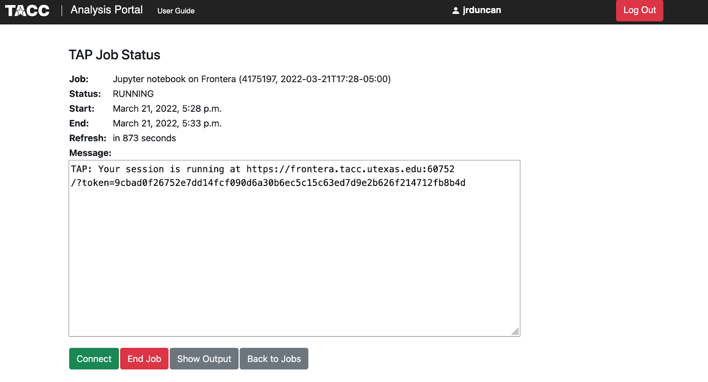

Containerized Kernel for Jupyter Notebooks
==========================================

Jupyter notebooks are popular web applications for building and sharing computational documents.  They have many convenient features including supporting several languages, creating interactive output – including data visualizations – in the notebook, and that they can be easily shared. 

TACC makes it easy to launch jupyter notebooks on our systems via a web interface called the `TACC analysis Portal (TAP) <https://tap.tacc.utexas.edu/jobs/>`_. Users can log on with their TACC usernames and password to TAP, then launch a jupyter notebook on a compute node on one of our systems.  For, example below we have requested a jupyter notebook on a development node on Frontera with the Frontera-training allocation. 

After clicking **Submit**, users will go to the following page where they will either be waiting in the queue or told that their jupyter notebook is ready to be launched.  When it is ready you will see something like the following. 

Finally, you would either Click **connect** or go the url shown in your web browser to open the requested jupyter notebooks (see below).

Now that you have opened jupyter, you can launch a notebook with the default Python kernel by clicking new → Python 3.  By default the Python environment will be the default environment you have set up on TACC systems.  However, users often have different projects with different environments.  To be able to easily access these environments via jupyter notebooks, you need to set up **jupyter kernels.**

What are Jupyter Kernels?
-------------------------
When we launch a jupyter notebook, we have the ability to select what **kernel** (program that executes code) we use. The ability to select different kernels allows you to execute code in different languages and environments for different applications.  These kernels could be a python virtual environment or a container you have set up. 

In the tutorial below, we will walk you through how to set up a containerized jupyter kernel. By doing this you will be able to select a kernel that executes code in different containers you have built. 

Containerized Kernels at TACC
-----------------------------
Note: This tutorial assumes you have a working container on dockerhub that runs on TACCs systems. We will reference the kernel created in the “Advanced Container Build” section of this tutorial. 

Optional: Download .sif file for a container
~~~~~~~~~~~~~~~~~~~~~~~~~~~~~~~~~~~~~~~~~~~~
To get started setting up a containerized kernel on TACC systems, let’s launch an idev session on frontera:

::

    idev -N 1 -p rtx-dev -m 120

Load apptainer module with:

::

    module load tacc-apptainer

Move to the location on TACCs filesystem where you would like to download the container.  For this example you could move to SCRATCH:

::

    cds 

Then, pull the container you would like to use from **dockerhub:**

::

    apptainer pull docker://[username]/[container name]:[tag]
    *Example:*
    apptainer pull docker://gjaffe/tune-container:0.13

The command above creates a **<container name>-<version tag>.sif** file which can be renamed and or stored where you need it.

Setup Kernel.json
~~~~~~~~~~~~~~~~~
In addition to the container, we need to add a kernel configuration json file to the users environment.  This file, named **kernel.json**, has the command to run the kernel, the name of the kernel (which appears in the New pulldown in Jupyter) and the language. 

Below is a generic kernel.json file for a kernel using a container and running Python.  In the file below you will need to make two modifications in the line highlighted in red font.  This includes adding the path to the .sif file for you container as well as adding a display name for this particular kernel: 

::

    {
    "argv": [
    "/opt/apps/tacc-apptainer/1.3.3/bin/apptainer",   
    "exec",
    "--nv",
    "--bind",
    "/run/user:/run/user",
    “PATH_TO_SIF_FILE”,   
    "python3",
    "-m",
    "ipykernel_launcher",
    "--debug",
    "-f",
    "{connection_file}"
    ],
    "display_name": "BERT",
    "language": "python"
    }

To fully understand building kernel.json files please reference the jupyter docs `here <https://jupyter-client.readthedocs.io/en/stable/kernels.html>`_. The import notes about the file above is that “argv” includes a list of command line arguments used to start the kernel. Above we are specifying that we want to launch the specified container with apptainer, they start python. Additionally, the “display_name” will be the name of the kernel displayed in the jupyter notebook UI. 

Installing Kernel
~~~~~~~~~~~~~~~~~
Once you have this file, it has to be installed in the **~/.local/share/jupyter/kernels/** space for that kernel.  Each kernel has its own directory (which should reflect which kernel it is but is not used by Jupyter).  To instal the kernel you need to execute the following commands:

::

    mkdir  ~/.local/share/jupyter/kernels/<kernel directory>
    cp kernel.json ~/.local/share/jupyter/kernels/<kernel directory>

Test Kernel via TAP
~~~~~~~~~~~~~~~~~~~

You should now see the notebook kernel listed in the New menu on the right top of the interface as seen in the image above.  To test that your code is working, open a notebook with the newly created kernel and copy and paste code you would like to execute. 

Changing Kernel
~~~~~~~~~~~~~~~
Note any notebook started with this kernel launched from the file selector will automatically use the kernel it was created with.  If you would like to change the kernel for a specific notebook you can select **kernel-> change kernel-> name_of_new_kernel**.  Then, once you save the notebook, this will become the default kernel for that notebook. 

