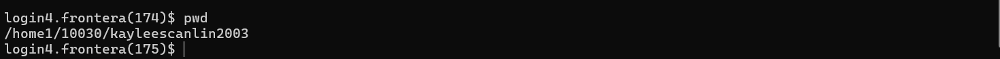
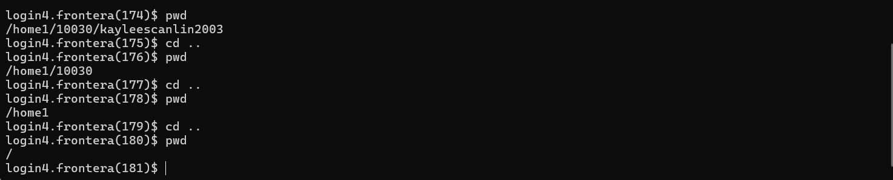
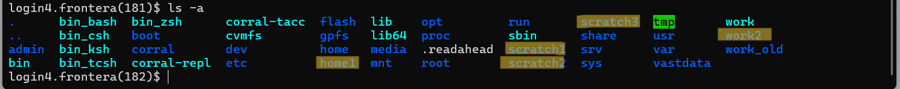
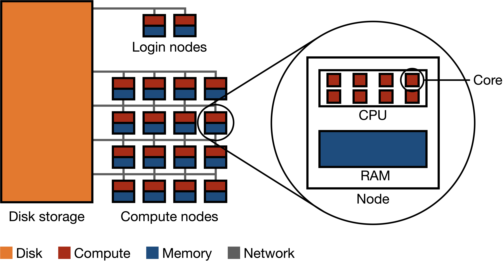

Connecting to TACC
==================

In this section will walk through the layout of TACC's computing resources and demonstrate how to connect to TACC systems using the ssh command in an interactive terminal session as well as connect via a jupyter notebook.

Prerequisites
-------------
1. **TACC Account**  
    - If you haven't yet, create a TACC account `here <https://tacc.utexas.edu/portal/login?from=/portal/>`__.  

Connecting to TACC
------------------
**Step 1: Open Your Terminal of Choice** 
   
**Step 2: Run the SSH Command**  
Use the following command to connect to TACC systems:

:: 

    ssh <username>@<hostname>

(replace `<username>` with your TACC username and `<hostname>` with the system hostname)

**Example:**
To connect to the Frontera system:

::

    ssh username@frontera.tacc.utexas.edu

**Step 3: Enter Your Password**  
When prompted, type your TACC password. If this is your first time logging in, you may be required to set up or reset your password.

**Step 4: Set Up Two-Factor Authentication**  
TACC systems require two-factor authentication. Follow the on-screen prompts to complete the process.

Tips and Troubleshooting
------------------------
- If you cannot connect through SHH, verify your username, hostname, and network settings.
- If you run into issues while using a machine, try using the TACC-specific Sanitytool module to run diagnostics: `sanitytool <https://docs.tacc.utexas.edu/include/sanitytool/>`_
- Contact TACC support if you encounter further issues: `TACC help desk <https://portal.tacc.utexas.edu/help/>`_

Directories Explained
---------------------

While working on TACC systems, there are 3 main directories that users can utilize: $HOME, $WORK, and $SCRATCH. 

**Directories:** 
    - **$HOME**: Useful for projects needing small environments as $HOME does not have much storage. It's typically used for personal scripts, configuration files, and other small files that you want to persist over time.
    - **$WORK**: Useful for general projects that require more storage and can be considered semi-persistent. This directory is designed for active data or ongoing work that needs more space than $HOME, but is not temporary. Files here are not as likely to be purged, but users should still manage space appropriately.
    - **$SCRATCH**: Useful for work that may be discarded, as this directory is regularly purged. $SCRATCH is ideal for temporary files, large datasets, or computational outputs that do not need to be preserved. This space is designed for jobs in progress or interim work that will be cleaned up automatically to avoid storage overflow.

.. note::
    The $WORK environment is different from the $SCRATCH and $HOME environments because it is mounted on the global shared file system hosted on **Stockyard**–meaning it is available on Frontera, Stampede3, and most of our HPC systems.

$WORK is the **highest** directory on a global shared file system between several different HPC systems because it makes sharing between machines easy. The organization of the $WORK directory is outlined in the following diagram.

.. image:: images/stockyard-2022.jpg
   :alt: stockyard_roots

*image source*: `https://docs.tacc.utexas.edu/hpc/lonestar6/#files <https://docs.tacc.utexas.edu/hpc/lonestar6/#files>`_

.. note::
    * **Constraints on Shared Resources** - Because so many users are running jobs on $WORK, high-intensity Input/Output (I/O) operations may cause performance bottlenecks and contention between users.
    * **Offload Files to $SCRATCH** - One method of solving this is to run high I/O operations in the $SCRATCH directory, created for the specific purpose of not overloading the $WORK directory, and moving output files into $WORK.
    * **Striping Large Files** - The $WORK file system has 24 I/O targets available, and stripe count should be adjusted accordingly. *It is generally advised to allocate at least one stripe for every 100 GB of file size, not exceeding 75% of available stripes.*

Issues Hosting Conda Environments on $WORK
--------------------------------------------
$WORK utilizes Lustre striping which is optimized for large files but can be inefficient for Conda environments, which contain thousands of small files.

Additional information about running Conda on TACC systems can be found in `How to Install Conda <ai_environments_at_tacc\docs\getting_starting_section\How to Install Conda.rst>`_, but for now, it is advisable to run Conda tasks in the $SCRATCH environment due to its high I/O load requirements.

How to Change your directory
----------------------------
SSHing into Frontera takes you to the $HOME directory by default. Try running the **pwd (Print Working Directory)** command to see where you are:

As you can see, we are on home. If you want to get onto a different directory, you will have to **CD into that directory** first.

Let's try CDing into the **$WORK** directory.

 **cd (change directory)** all the way back to the main directory of the system, so we can get into the $WORK directory. Here the working directory is also printed out to the screen with pwd to visualize going back in our directories:

Let's see where our $WORK directory is. Use **ls -a (list all)** to view all files in the current directory:

Notice how we have the disk options that were presented to us when we first logged onto Frontera available for us to cd into (home1, work2, and scratch1, scratch2, and scratch3).

These are the $HOME, $WORK, and $SCRATCH directories available for you specifically–and they may differ depending on the user.

Let's cd into **our specific work directory** with the following command:

::

    cd/work/#####/<username>

Where the numbers ##### will be your group number, and the <username> your TACC username.

When you get to your directory, you’ll see that you have multiple partitions available to you depending on the system you’re using:

This is a unique quality of the **$WORK** directories. Because they’re mounted in Stockyard and **shared across all systems**, you can access files from other systems with ease. Let's try getting into **Frontera**. Cd into Frontera with:

::

    cd frontera

When you run pwd, your working directory should now be:

::

    /work/#####/<username>/frontera

Congrats! You are now in your WORK directory.

Requesting a Node to Work On
----------------------------
A node on one of the TACC systems refers to an individual CPU paired with some memory and local storage. Most of our systems are composed of **compute** nodes (for running tasks) and **login** nodes (for directing users and tasks towards the compute nodes).

In a typical HPC system, there are many more compute nodes than login nodes:

*image source*: `ekatsevi.github.io <https://ekatsevi.github.io/statistical-computing/hpc-basics.html#:~:text=Login%20nodes%20are%20like%20a,the%20workhorses%20of%20the%20HPC>`_

**It is important to avoid running tasks on the login nodes** because login nodes are shared between multiple users. If you run tasks on login nodes, you will degrade the ability of the node to handle other users logging onto the system, and can affect the amount of time they will be waiting in the queue.

Each system has different kinds of nodes with different specifications for each, you can find their documentation `here <https://tacc.utexas.edu/systems/all/>`__.

Requesting a Specific Node (GPU, CPU, etc.)
-------------------------------------------

**Why request a specific kind of node?**
Many TACC systems have both CPU-only nodes and CPU+GPU nodes available to use. The GPU nodes tend to be in higher demand and therefore the queue times for getting access to a node are longer.  If your code does not need a GPU, you will wait less time for your job to start if you request a CPU-only node.

Connect using Jupyter Notebooks with the TACC Analysis Portal (TAP)
-------------------------------------------------------------------
There are multiple ways to request a node on the TACC systems. The easiest method of doing so would be from the tacc analysis portal if you are using Frontera, Stampede3, Lone Star 6, or Vista: https://tap.tacc.utexas.edu/

Ensure you have a TACC user account before attempting to use the analysis portal.

When you have successfully logged into the analysis portal you should end up here:

We will select **Frontera** as the system, **DCV remote desktop** as our application, and **OTH 24002** as our project:

The **queue** option will determine which type of node you are requesting. Note that the node options listed will differ depending on the system you are using.

You can also choose the amount of nodes you may need for your task, as well as the time limit your job will have:

Requesting a Node Through idev
------------------------------
Another way to get access to a compute node is using the command line command idev, the interactive development environment for TACC systems: https://docs.tacc.utexas.edu/software/idev/

The idev command both handles submitting the request for a compute node and automatically creates an interactive terminal connection to your requested node allowing you to execute scripts and manage files with real-time feedback directly in the terminal. 

Extra information
-----------------
For more information, visit the official TACC documentation:
`<https://www.tacc.utexas.edu/user-services/user-guides/>`_

