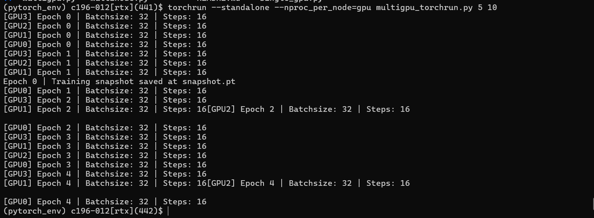

How to Create and Activate a Virtual Environment
================================================

Virtual environments are essential for isolating project dependencies and ensuring compatibility across different projects. This guide explains how to create a virtual environment using Python's built-in `venv` module.

Prerequisites
-------------
   - Python 3.3 or newer installed on your system. (Usually pre-installed)
   - A terminal or command prompt to execute commands.

.. note::
    Some parts of this tutorial require the use of Git, which is pre-installed onto TACC systems. 

Steps to Create a Virtual Environment
-------------------------------------

1. **Open a Terminal or Command Prompt**
   Open the terminal (or Command Prompt on Windows), SSH onto a TACC machine, and navigate to the directory where you want to create the virtual environment.

**Step 2: Run the SSH Command**  
Use the following command to connect to TACC systems:

:: 

    ssh <username>@<hostname>

(replace `<username>` with your TACC username and `<hostname>` with the system hostname)

For the purposes of this tutorial, we will be utilizing the **Frontera** system, so our command should look like:

::

    ssh <username>@frontera.tacc.utexas.edu

.. note::
   
    It is best practice to use the $WORK directory to host our environment, since the $SCRATCH directory is regularly purged, and $HOME does not have the storage space for ML tasks.

**Step 5. Create the Virtual Environment**
    Run this command to create a virtual environment. You can replace 'myenv' with whatever you want to name your virtual environment.

   ::

         python3 -m venv myenv

**Step 6. Verify the Creation**
   After running the command, a new directory (e.g., `myenv`) will be created in your current location. This directory contains the files needed for the virtual environment.

    ::
        
        (base) UserName@System myenv % ls
        bin		include		lib		pyvenv.cfg

Understanding the Structure
---------------------------
The virtual environment directory contains:
   - **`bin` or `Scripts`**: Contains the executables, including the Python interpreter.
   - **`lib`**: Includes the standard library and site packages for your virtual environment.
   - **`pyvenv.cfg`**: Configuration file for the virtual environment.

Virtual environments are an essential tool in Python development, allowing you to isolate project dependencies and avoid conflicts between different projects. This guide will walk you through the steps to activate a virtual environment.

Prerequisites
-------------
Before activating a virtual environment, ensure you have the following:
    - Python installed on your system.
    - A virtual environment created using `venv`.

Steps to Activate a Virtual Environment
---------------------------------------

.. note:: 
    
    Ensure you are SSH-ed into a TACC machine and in the proper directory.

1. Navigate to the directory containing your virtual environment using `cd`.
2. Run the following command:

    ::
            
        cd /path/to/your/environment

In our case, it should look like:

    ::
        cd /work/<group number>/<TACC username>/frontera/myenv

3. Activate the environment with:

    ::

        source /work/<group number>/<TACC username>/frontera/myenv/**bin/activate**

Upon activation, you should see parentheses around the name of your environment appear in front of your working directory, like so:

    ::
        
        (myenv) login3.frontera(470)$

Deactivating a Virtual Environment
----------------------------------
When you’re done working in your virtual environment, you can deactivate it to return to the global Python environment:

1. Simply run the following command in your terminal (works on all operating systems):

    ::

        deactivate

2. You’ll notice the environment name disappears from your command line, confirming the environment has been deactivated.

Troubleshooting
---------------
- If the `activate` command is not recognized, ensure you’re in the correct directory where the virtual environment was created.

Congratulations! You now know how to activate and deactivate a virtual environment to keep your Python projects organized and conflict-free.

Let's try **testing this Virtual environment by running a script.**

Testing our Virtual Environment with Multigpu_Torchrun.py
---------------------------------------------------------
**Multigpu_Torchrun.py** is a script from the official Pytorch repository that leverages **distributed data parallel (DDP)** to split ML training tasks across GPUs,
allowing for a more efficient runtime. The Multigpu_Torchrun.py script can be found in the Github repository below:

`https://github.com/pytorch/examples <https://github.com/pytorch/examples>`_

To test whether our virtual environment works and can run Pytorch scripts, models, and other complex ML tasks in isolation, we'll be **downloading the Multigpu script from this repository**, **installing Pytorch**, and **running an example benchmarking function from the script**, all **within our virtual environment**.

**Step 1. Reactivate your new environment**

**Step 2. Download the repository inside of the environment**
You can download a Github repository through the command line with the command **git clone**.

::

    git clone https://github.com/pytorch/examples.git

**Step 3. Request a Node through idev**
To run our example script, we'll need to allocate a single node for the purposes of our task. One node on Frontera has 4 GPUs, which is adequate to run Multigpu_Torchrun.py's benchmarking function.

.. note::
    We request a single node because Multigpu_Torchrun runs training tasks across as many nodes on the system as possible by default, and if we run it without specifying a number of nodes to use, it may affect the runtime of other users on the system.

Begin your `idev <https://docs.tacc.utexas.edu/software/idev/>`_ session by running the following in your virtual environment:
::

    idev -N 1 -n 1 -p rtx-dev -t 02:00:00

This will request a **single compute node (-N 1 -n 1)** in the **rtx-dev** partition/queue **(-p)** for a time length of **two hours (-t 02:00:00).**
The rtx-dev queue is specifically for the NVIDIA RTX-5000 GPU compute nodes on Frontera systems, which are compatible with CUDA and Pytorch by extension. To determine the queues and hardware specifications of TACC's HPC systems, see our `website <https://tacc.utexas.edu/systems/all/>`_ for more information.

When you request a node through idev, you will be taken to a loading screen. After your idev session starts, your current working directory will look like:

::

    (myenv) c196-011[rtx](452)$

This is how you will know your idev session has begun. **Ensure you see the (myenv) tag before your working directory. If you do not, activate your virtual environment again.** 

**Step 4. Download Pytorch into our Virtual Environment**
To run Multigpu_Torchrun, we will need to install Pytorch and a few critical Torch libraries to support our script's ML training tasks. Run the following pip command inside of your virtual environment to install Pytorch:

::

    pip3 install torch torchvision torchaudio

**Step 5. CD into the ddp tutorial series folder**
We should now see a new directory called **examples** present in our virtual environment.
**cd** into the following directory:

::
    
    cd examples/distributed/ddp-tutorial-series

*This will be a hidden directory.*

**Step 6. Run multigpu_torchrun.py**
And within our virtual environment, we will use the **torchrun** command to launch the training script across all of the available nodes (1).

::
    torchrun --standalone --nproc_per_node=gpu multigpu_torchrun.py 5 10

This will distribute the training workload across all GPUs on your machine using `torch.distributed` and `DistributedDataParallel` (DDP), and train the model for 5 epochs and run checkpoints every 10 seconds.

When run successfully, you should get a result like this:

.. note::
    The task may take a few minutes to run.

Congratulations! You have now run a successful multi-GPU training task in a virtual python environment.

