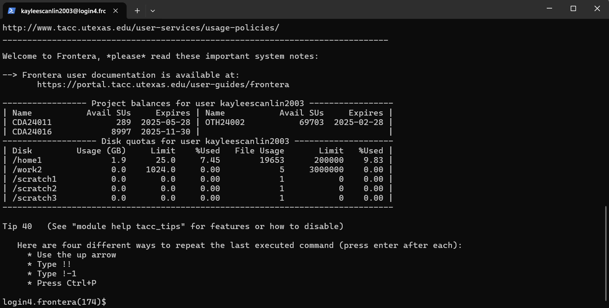
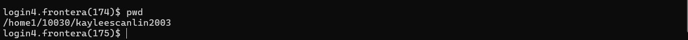
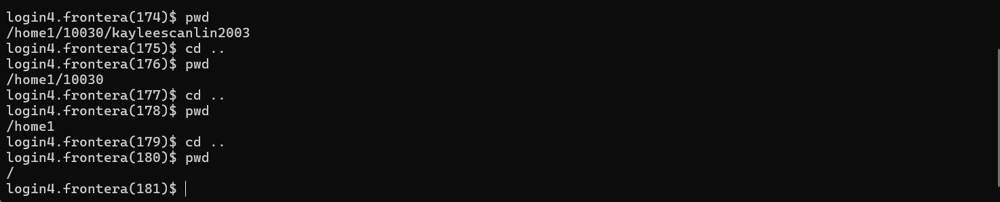
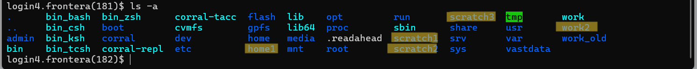

Conda with Pytorch
==================

Now that we have set up a virtual environment in Python using the venv module, let's take a look at an alternative method of setting up virtual environments with **Conda**.

Conda is a powerful package manager and environment management tool, widely used in data science and machine learning to manage dependencies and create isolated environments for different projects. This guide will walk you through the steps to install Conda on your system.

What is Conda-Forge and Mini-Forge?
-----------------------------------
Conda-Forge is a comunity-driven repository of conda packages. Mini-Forge is a lightweight installer for Conda, optimized to use Conda-Forge by default. For this guide's purposes, we will use MiniForge.

Steps to Install Conda
----------------------
**Step 1. Open a Terminal or Command Prompt.**

**Step 2: Run the SSH Command**  
Use the following command to connect to TACC systems:

:: 

    ssh <username>@<hostname>

(replace `<username>` with your TACC username and `<hostname>` with the system hostname)

**Example:**
To connect to the Frontera system:

::

    ssh username@frontera.tacc.utexas.edu

**Enter Your Password**  
When prompted, type your TACC password. If this is your first time logging in, you may be required to set up or reset your password.

**Step 3: Set Up Two-Factor Authentication**  
TACC systems require two-factor authentication. Follow the on-screen prompts to complete the process.

.. note::
   
    It is best practice to use the $WORK directory to host our environment, since the $SCRATCH directory is regularly purged, and $HOME does not have the storage space for ML tasks.

- Although in terms of I/O, **$SCRATCH** is actually the best place to install Conda and run subsequent tasks, files in this directory are routinely purged to save space. If you choose to install Conda in $SCRATCH, understand that you may have to re-install every so often.
- Ensure any output is bundled into a .tar file and moved into $WORK if using Conda for a high I/O task in $SCRATCH.
- **Placing Conda in $WORK is the best possible environment because it has enough storage capacity for Conda’s precompiled packages (NumPy, Tensorflow, etc.) but is not regularly purged.**

**Step 4. Install MiniForge**
Miniforge is a mini Conda installer that we can use as an alternative to Anaconda and Miniconda. We will be using it to download Conda into the $WORK directory.
We are going to install Conda in **Frontera** for the sake of this tutorial. When you SSH into Frontera, you will see this screen:

SSHing into Frontera takes you to the $HOME directory by default. Try running the **pwd (Print Working Directory)** command to see where you are:

As you can see, we are on home. We need to get into Work. **cd (change directory)** all the way back to the main directory of the system, so we can choose to install Conda on the $WORK directory. Here the working directory is also printed out to the screen with pwd to visualize going back in our directories:

Let's see where our $WORK directory is. Use **ls -a (list all)** to view all files in the current directory:

Notice how we have the disk options that were presented to us when we first logged onto Frontera available for us to cd into (home1, work2, and scratch1, scratch2, and scratch3).

These are the $HOME, $WORK, and $SCRATCH directories available for you specifically–and they may differ depending on the user.

Let's cd into **our specific work directory** with the following command:

::

    cd/work/#####/<username>

Where the numbers ##### will be your group number, and the <username> your TACC username.

When you get to your directory, you’ll see that you have multiple partitions available to you depending on the system you’re using:

This is a unique quality of the **$WORK** directories. Because they’re mounted in Stockyard and **shared across all systems**, you can access files from other systems with ease. We are on frontera, and we’ll be installing conda in the frontera work directory. Cd into frontera with:

::

    cd frontera

When you run pwd, your working directory should now be:

::

    /work/#####/<username>/frontera

Now that we’re in the work directory for frontera, we can install Conda. Use **curl** (a command-line tool to transfer data from a server via HTTP) to download Miniforge without having to download it to our local machine, which will come bundled with conda.

Run the following command in your terminal:

(You may also use wget if you prefer).

::

    curl -LO https://github.com/conda-forge/miniforge/releases/latest/download/Miniforge3-Linux-x86_64.sh

.. note::
    This download pulls it directly from the github link for the Linux architecture, which is what our systems use. If you follow this tutorial to install it on a local machine, you will need to change the URL to the installation file containing Miniforge for your system, which can be found in the same repo:
    https://github.com/conda-forge/miniforge/releases

Now make the execution script executable with **chmod**, which modifies file permissions so that we can execute (**+x**) the file:

::

    chmod +x Miniforge3-Linux-x86_64.sh

Now we can run the Miniforge installer:

::

    bash Miniforge3-Linux-x86_64.sh

.. note::
    When you run the bash script, you will have some disclaimers pop up on your command line during the installation process. This disclaimer will walk you through the installation steps for Miniforge, but it will present to you a default installation folder that is in the **$HOME** directory.
    **Ensure you change this to your work/frontera directory before you install Miniforge.**

After running the bash script, it will ask you to update your shell profile to automatically initialize conda. **Type ‘yes’.**

**Step 5. Initialize Conda**
   After installation, initialize Conda to configure your shell:
    
    ::

        conda init

    Restart your terminal for the changes to take effect.

**Step 6. Verify the Installation**
    Confirm that Conda is installed by running:
    
    ::
        
        conda --version
    
    This should display the installed Conda version.

Congratulations! You now have Conda installed on your system.

Creating and Managing Environments
----------------------------------
Once Conda is installed, you can start creating and managing environments using the following commands:

1. **Create a new environment**:

    ::
        
        conda create --name myenv python

2. **Activate an environment**:

    ::
        
        conda activate myenv 

3. **Deactivate an environment**:

    ::

        conda deactivate

4. **Remove an environment**:

    ::
        
        conda remove --name myenv --all

Lets Install & Test PyTorch
---------------------------
Now that we have Conda installed and we understand how to **activate**, **deactivate**, and **delete** environments, let's try **installing and testing pytorch** by running the **multigpu_torchrun.py** script from the official Pytorch library.
This script facilitates and streamlines the training of ML models on multiple GPUs, as well as benchmarks the performance of Pytorch-based models on multiple GPUs.

To run the multi_gpu_torchrun script, we must first use the **idev** tool to request a GPU Node. Each Node on Frontera is comprised of four GPUs, which is why we'll only request one to run the multigpu_torchrun.py script.

**Step 1. Request a Node through idev**
idev is a tool developed by TACC to facilitate real-time software development on our HPC systems. It also enables us to request a specific kind and number of nodes through the command line, which we would only be able to do otherwise through the Tacc Analysis Portal (TAP).
First, we'll start an idev session. Ensure your current directory is:

::

    /work/<group number>/<TACC username>/frontera

You should be in the **work** folder for Frontera. In this work folder, begin your idev session by running:

::

    idev -N 1 -n 1 -p rtx-dev -t 02:00:00

.. note:
    If we don't specifically request 1 compute node beforehand, when we run the multigpu_torchrun.py script, the program will run it on every GPU available. This may affect others using the GPU nodes on Frontera.

When you request a node through idev, you will be taken to a loading screen as your job awaits being run. After your idev session starts, your current working directory will look like:

::

    c196-012[rtx](416)$

This is how you will know your idev session has begun.

**Step 3. Create a Conda Environment**
We can now create our first Conda Environment. Create a **Python 3.10** environment to ensure it works with CUDA by running the command:

::

    conda create --name pytorch_env python=3.10

Upon creation, the terminal should prompt you with a series of yes/no questions pertaining to the libraries that Conda will automatically install in the environment.
Select **yes** to create the environment.

Once the environment is created, **activate** it with:

::

    conda activate pytorch_environment

Once the environment is properly activated, your working directory should look like:

::

    (pytorch_env) c196-012[rtx](418)$

**Step 4. Install Pytorch in Conda Environment**
To install Pytorch in our new Conda environment- which is in the $WORK directory of Frontera, running in a single rtx node idev session- run the following Conda command in the environment:

.. note::
    We will need to install Cuda to run the multigpu_torchrun.py file on the Frontera's NVIDIA GPUs.

::

    conda install pytorch torchvision torchaudio pytorch-cuda=12.6 -c pytorch -c nvidia

Step 5. Running an Example Script
---------------------------------
Now that we have requested a specific number of GPU nodes to use with idev and created a Conda environment with Pytorch, we can try running an example script where we ensure that our environment works for multi-GPU training- a task with many applications in ML/AI in HPCs.
By downloading and running a python script from the official Pytorch repository called **multigpu_torchrun.py**, we can enable single training jobs to utilize multiple GPUs on a machine.

*This portion of the tutorial will require the use of Git- do not worry about downloading it. It is already installed on TACC systems!*

**Step 5. Clone the Pytorch Repository**
This is an official repository containing dozens of example scripts from the Pytorch library. For the purposes of this tutorial, we will be cloning it into our new environment. 

::

    git clone https://github.com/pytorch/examples.git

**Step 6. CD into the ddp tutorial series folder**
Upon listing all of the directories now present in the **$WORK** folder, we should now see a new directory called **examples**.
Now **cd** into the following directory:

::
    
    cd examples/distributed/ddp-tutorial-series

**Step 7. Run multigpu_torchrun.py**
And within our virtual environment, we will use the **torchrun** command to launch the training script across all of the available nodes (1).

::

    torchrun --standalone --nproc_per_node=gpu multigpu_torchrun.py 5 10

This will distribute the training workload across all GPUs on your machine using `torch.distributed` and `DistributedDataParallel` (DDP), and train the model for 5 epochs and run checkpoints every 10 seconds.

When run successfully, you should get a result like this:

.. image:: images/multigpu_result.png
    :alt: multigpu_result

Congratulations! You have now run a successful multi-GPU training task in a Conda environment.

OPTIONAL: Export Environment & Manage Dependencies with a YAML file
-------------------------------------------------------------------
If you would like, you can manage your Conda environments using a YAML file, which helps ensure consistency across different systems and distributed environments.

Typically, conda environments are managed in a file called **environment.yml**, which defines and manages dependencies, environments, and channels. Let’s manually create one–you will need vim or nano to do this through the command line.

**Step 1. Create an empty YAML File**
First, we'll need to create an empty environment.yml file to store our dependencies in with the following command:

::

    touch environment.yml

**Step 2. Add your environment variables to your YAML File**
Use the vim command **vim environment.yml** to open your environment file, then click the **insert** key on your keyboard to begin typing in these dependencies. When you are finished, click **esc** to get out of write mode, and then type in **:wq (write quick)** to save the contents of your file and exit out.

::

    name: pytorch_env
    channels:
        - pytorch
        - defaults
    dependencies:
        - python=3.10
        - pytorch
        - torchvision
        - torchaudio
        - cudatoolkit=12.6

**Step 3. Create your Conda environment with environment.yml**
Now that we have our environment.yml file created, we can activate it with:

::
    
    conda env create -f environment.yml

**Step 4. Activate Conda Environment**
Now that we have our **environment.yml** file created, we can activate it with:

::

    conda activate pytorch_env

Congrats! Now you have a conda environment made with those dependencies that is easily shared between users thanks to our YAML file.

**Step 5. Export your Conda Environment**
You can now share this environment easily between systems thanks to the environment.yml file.
Export it using the following command:

::
 
    conda env export > environment.yml

Summary
-------
In this tutorial, you used idev to **request a GPU node to work on**, **installed and used Conda to create a virtual environment**, **installed Pytorch in a virtual environment**, and then **ran an example script using multiple GPUs for AI/ML training tasks and benchmarking.**

For more information about multi-GPU training, see the following documentation: `Distributed Data Parallel in Pytorch <https://pytorch.org/tutorials/beginner/ddp_series_intro.html>`_

For more a more in-depth guide to using Conda, visit the official Conda documentation: https://docs.conda.io/
